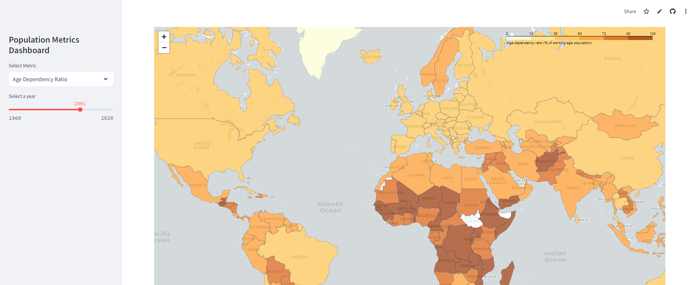

# Project 3: Data Visualization - Population Metrics Dashboard

# Overview

Working dashboard can viewed at https://population-metrics-dashboard.streamlit.app/

## Background & Purpose
Fertility rates and population growth/decline are critical indicators of demographic trends that shape societies worldwide. As nations navigate economic, social, and environmental challenges, these rates have varied significantly, reflecting cultural norms, access to healthcare, global events, and government policies. Our project aims to visualize global population trends over the last 60 years with the goal of identifying factors which impact the generally perceived downward trend in overall population. We aim to highlight some of the realities of the current population demographics, and birth rates to provide some idea of future global trends.

## Data Source
For our analysis, we primarily used the dataset “World Development Indicators” provided by the World Bank Group, available publicly on their Databank website and as a public dataset on Google's BigQuery SQL Database.  We chose this dataset specifically because it utilized the most robust set of variables and indicators which aligned closely with our visualization and analysis goals.
*  The World Bank's World Development Indicators dataset on Google Cloud BigQuery SQL Database (used for this project via its API): https://console.cloud.google.com/marketplace/product/the-world-bank/wdi
*  The World Bank's World Development Indicators database on DataBank: https://databank.worldbank.org/source/world-development-indicators

## Dependencies & Installations
* Python and the following libraries/frameworks
    * streamlit
    * google-cloud-bigquery 3.26.0
    * google-auth-httplib2 0.2.0
    * pandas
    * folium 0.18.0
    * requests 2.32.3
    * streamlit_folium 0.23.1
    * plotly-express 0.4.1

## Program Execution
* Streamlit Cloud Access (RECOMMENDED) - while the program can be run locally, it is recommended to access the live cloud based streamlit app at the following link: https://population-metrics-dashboard.streamlit.app/
* To run the program locally, use following files and directories:
        * '.devcontainer' directory
        * '.github' directory
        * 'requirements.txt'
        * streamlit_app.py
        * '.streamlit' directory containing file 'secrets.toml'
        * Google BigQuery API server account key
    * Once all files, directories, and credentials are compiled, the program can run by using command ```streamlit run streamlit_app.py```

NOTE: 'secrets.toml' needs to be created using credentials from a Google Cloud account that has the BigQuery API enabled.  Details and instructions on how to create this file can be found at https://docs.streamlit.io/develop/tutorials/databases/bigquery

## Interaction & Functionality
The Population Metrics Dashboard has several different features that allows a user to interact with the data and see the changes in the listed variables over time per country.

The sidebar provides a both a dropdown menu that provides a selection of different metrics to visualize as well as a slider that sets the year to observe between 1960 to 2020.  The selections made using these widgets will automatically update the of the dashboard visuals.


The main section of the dashboard features an interactice global choropleth map, built using the folium libarary.  As per the legend, the color scale provides a visual of a given metric differs between each different country.



In addition to typical scrolling and zoom features(clicking on an individual country will automatically zoom in closer on that country), simply hovering over any country will automatically reveal a popup/tooltip that includes additional metrics for that country.  Depending on the main metric, the pop/tooltip will show different metrics that provide granular or complementary data to the main metric chosen from the drop down menu.


Below the map, are two bar charts that reflect the top 10 and bottom 10 countries for the selected metric.  This allows a user to get an immediate highlight of countries that lead and lag for a given metric and may be of particular interest for further exploration through the dashboard's functionality.


While the data is robust, in the event of no data being available for a given year, an error message will display along with the list of years for which data for the selected metric is available.


# Ethical Considerations
In developing this data visualization project, we were committed to upholding the highest ethical standards. We prioritized transparency by using publically available datasets provided by the World Bank, clearly documenting our methodologies, and any assumptions made during analysis. We recognize the potential impact of our work and remain dedicated to promoting responsible data usage, fostering trust, and encouraging informed decision-making.  We were also mindful of any potential biases that could have been introduced choosing metrics and comparing data for various countries.  We endeavored to conduct additional research and review in order to maintain as much objectivity and representation as possible.

# Authors
Assiba Lea Apovo, Cassidy Cruz, Widchy Joachim, Daniel Pineda, and Edward Tabije

# Acknowledgments
data_visualization_project was created as an assignment for the University of California, Irvine Data Analytics Bootcamp - June 2024 Cohort under the instruction and guidance of Melissa Ingle (Instructor) and Mitchell Stone (TA). The practical exercises and coding examples demonstrated through the bootcamp helped inform and inspire the code for this project.

Additionally, the following resources were used for further reference:

* [Connect Streamlit to Google BigQuery - Streamlit Docs](https://docs.streamlit.io/develop/tutorials/databases/bigquery) - referenced connecting BigQuery to Streamlit ('streamlit_app.py'- lines 24-127)
* [Streamlit Documentation](https://docs.streamlit.io/) - referenced for syntax and structure streamlit objects and functions ('streamlit_app.py'- lines 130-144, 243-290)
* [User guide -- Folium 0.18.0 documentation](https://python-visualization.github.io/folium/latest/user_guide.html) - referenced for syntax and structure folium objects and functions ('streamlit_app.py'- lines 212-236)
* [Create Dashboard with Folium Map, Streamlit and Python - Full Course (44:28-57:02)](https://www.youtube.com/watch?v=uXj76K9Lnqc) - referenced for adding to a GeoJSON for a folium choropleth ('streamlit_app.py'- lines 149-173)
* [Building a dashboard in Python using Streamlit](https://blog.streamlit.io/crafting-a-dashboard-app-in-python-using-streamlit/) - referenced for sidebar functionality and organizing charts and visuals into streamlit columns ('streamlit_app.py'- lines 130-141, 243-290)

* [Make streamlit map width responsive #713 - gee-community/geemap](https://github.com/gee-community/geemap/issues/713) - used code solution for making a streamlit map size responsive ('streamlit_app.py'- lines 244-252, 272-280)